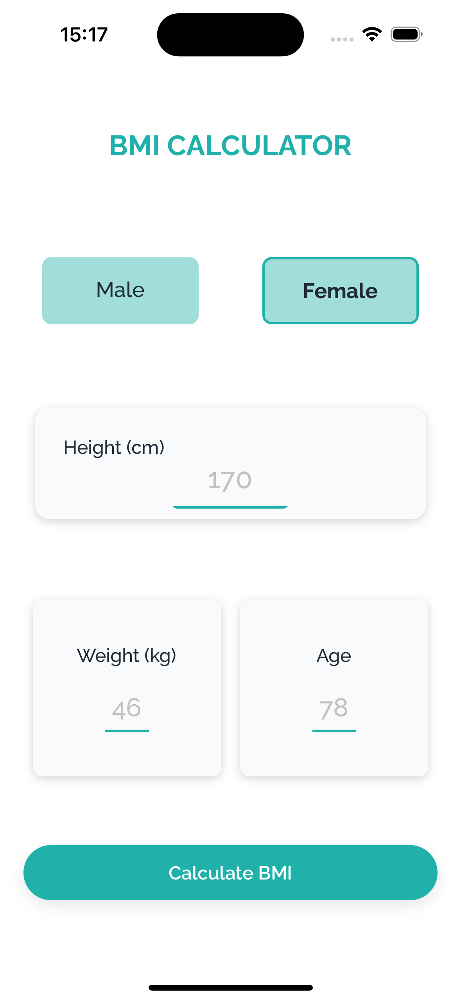

# BMI Native App

A simple and intuitive native mobile application for calculating Body Mass Index (BMI). This app allows users to input their weight and height to determine their BMI and understand their health status.

## 🚀 Features

- Input weight (kg/lb) and height (cm/inches)
- Real-time BMI calculation
- Clear health category (Underweight, Normal, Overweight, Obese)
- Clean and user-friendly interface
- Lightweight and fast performance

## 📱 Screenshots

